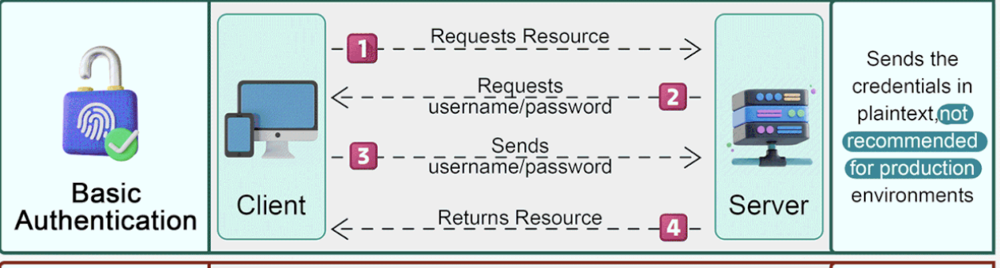
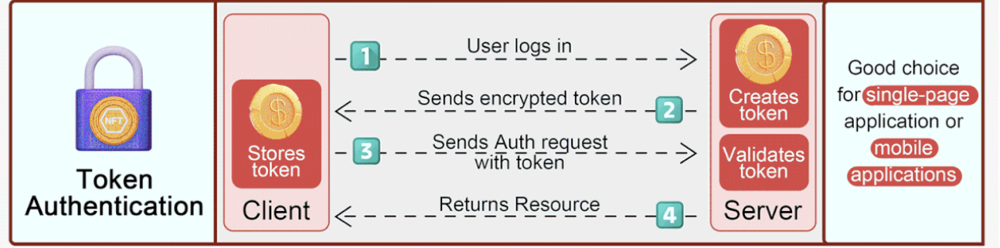
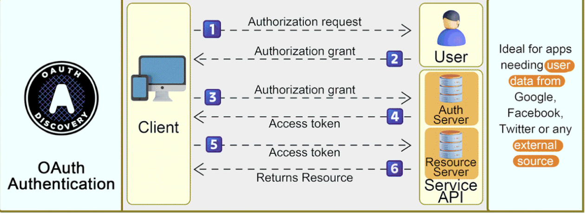
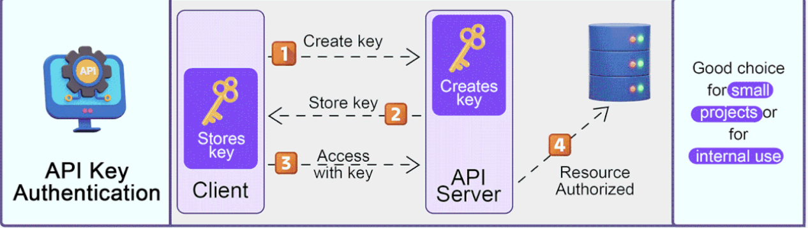

# Rest API Authentication Method

## 1. Basic authentication
- Gửi kèm username và password với mỗi request

  `Authorization: Basic <credentials>`

  credentials có thể là username:password hoặc là mã base64 của username:password

- Nó được sử dụng nơi mà vấn đề bảo mật không phải là mối quan tâm đáng ngại, hoặc được sử dụng qua các kết nối an toàn.

## 2. Token authentication
- Sử dụng token được generate như JSON web token (JWT), được sử dụng trao đổi giữa client và server, cung cấp khả năng bảo mật cao mà không cần gửi thông tin đăng nhập với mỗi yêu cầu
- Thích hợp sử dụng cho các hệ thống an toàn và có khả năng mở rộng.

## 3. OAuth authentication
- Cho phép bên thử 3 truy cập hạn chế vào tài nguyên của người dùng mà không tiết lộ thông tin đăng nhập bằng cách lấy access token sau khi người dùng cấp xác thực.
- Được sử dụng lý tưởng cho các tình huống yêu cầu quyền truy cập của người dùng thông qua hệ thống khác, hoặc dich vụ bên thứ 3 như Google, Facebook,...

## 4. API Key authentication
- Tạo ra khoá duy nhất cho người dùng hay ứng dụng được gửi trong header

- Được sử dụng trong việc kiểm soát truy cập vào một số tính năng nhất định, có thể theo giõi và giới hạn về tốc độ, số lương yêu cầu.

- Ưu điểm là dễ triển khai, quản lý

- Nhược điểm: Nếu API key bị lộ ai có key đều có thể truy cập, không xác minh danh tính người đùng

