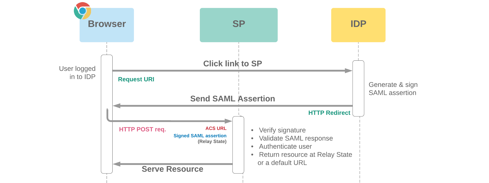

# Single Sign-On (SSO)

**SSO** là một phương pháp xác thực mà người dùng chỉ cần đăng nhập một lần để truy cập vào nhiều ứng dụng hay nhiều dịch vụ khác nhau mà không cần phải nhập lại thông tin đăng nhập hệ thống. Chẳng hạn như chúng ta sử dụng dịch vụ SSO của google, khi đăng nhập vào google chrome thì chúng ta sẽ không cần đăng nhập lại khi truy cập vào gmail hay là google driver.

Ví dụ: Google sign-in, Facebook login,..

### Một số khái niệm mà chúng ta cần biết

- **Identity Provider (IdP)**: đây là một hệ thống chịu trách nhiệm xác thực người dùng và cung cấp thông tin về danh tính của họ
- **Service Provider (SP)**: Là nhà cung cấp dịch vụ hoặc ứng dụng mà người dùng muốn truy cập. **SP** không trực tiếp xác thực người dùng mà nó gửi yêu cầu xác thực tới **IdP**.
- **Single Sign-On Token**: Sau khi người dùng xác thực với IdP, IdP tạo ra một `token` xác thực (thường là JWT) chứa thông tin xác thực và quyền truy cập. `Token` này được gửi đến **SP** để xác thực và cấp quyền truy cập
- **Federation**: Liên kết các hệ thống với nhau để tạo ra trải nghiệm đơn đăng nhập thông qua các chuẩn như **SAML (Security Assertion Markup Language)** hoặc **OAuth (Open Authorization)**, **OIDC (Open ID)**.

### Quá trình SSO

1. Người dùng truy cập đến một ứng dụng hoặc dịch vụ chưa đăng nhập
2. Ứng dụng yêu cầu xác thực và chuyển hướng người dùng đến IdP
3. Người dùng xác thực với IdP
4. IdP tạo ra một token xác thực và chuyển hướng người dùng trở lại ứng dụng với token đó
5. Ứng dụng xác thực token và cấp quyền truy cập

### Triển khai (Google)

1. Ở client ở đây tôi ví dụ với reactJS chúng ta sẽ thêm thư viện `google-signin-button`
2. Tạo dự án trong google developers console và lấy ClientID
3. Cấu hình vào trang web

#### Flow:

- Sau khi người dùng đăng nhập bằng Google Sign-In, frontend sẽ nhận được một ID token tưg goole, chúng ta cần gửi ID token tới backend
- Backend cần xác thực ID token để đảm bảo rằng nó được ký bởi google và không bị thay đổi trong quá trình truyển tải, ở bước này chúng ta có thể sử dụng một số lib có sẵn
- Xử lý thông tin người dùng
- Tạo tài khoản người dùng hoặc kiểm tra đã tồn tại
- Tạo và quản lý một token mới để sử dụng cho các yêu cầu tiếp theo
