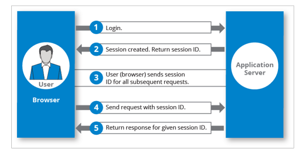

# Session

- Session (phiên): là một kỹ thuật dùng để quản lý thông tin người dùng trong suốt thời gian tương tác với hệ thống, khi người dùng đăng nhập thành công server sẽ tạo ra một session mới và lưu trữ thông tin đến người dùng đó ví dụ như

  - Tên người dùng
  - ID
  - Role
  - Giỏ hàng
  - Hoặc các thông tin cần thiết khác

- Thông tin này sẽ được lưu trữ ở trên server ở đây có một số cách như sau
  - Lưu trữ trong bộ nhớ: Đây là một phương pháp đơn giản nhất nhưng cũng có hiệu suất cao nhất, tuy nhiên dữ liệu session sẽ bị mất nếu server bị khởi động lại hoặc gặp sự cố.
  - Lưu trữ trong database: Phương pháp nay cho chúng ta tính bền bỉ nhưng có thể ảnh hưởng tới hiệu suất của ứng dụng.
  - Lưu trữ trong redis: đáp ứng những nhược điểm trên nhưng vẫn giữ được hiệu suất cao của ứng dụng

### Quá trình hạot động

1. Người dùng đăng nhập bằng cách cung cấp thông tin tài khoản
2. Server xác thực, nếu hợp lệ server sẽ tạo ra một session mới lưu trữ thông tin người dùng và gửi session ID cho client thông qua một cookie
3. Cookie được lưu trữ trên trình duyệt của người dùng
4. Trong các yêu cầu tiếp theo, client sẽ gửi session ID trong cookie kèm theo mỗi yêu cầu
5. Server nhận và tra cứu thông tin

### Các vấn đề bảo mật

- Session fixation: hacker dự đoán hoặc bắt giữ session ID của người dùng bất hợp pháp để mạo danh
- Cross-site request forgery: Hacker lừa người dùng thực hiện các hành động không mong muốn như nhúng vào trang web hoặc email
- Session hijacking: Hacker có thể đánh cắp session ID của người dùng bằng cách sử dụng các kỹ thuật như sniffing hoặc XSS
- Session replay: Hacker có thể ghi lại các yêu cầu HTTP của người dùng một cách bất hợp pháp sau đó phát lại chúng để truy cập trái phép
- Cookiejacking: Cũng tương tự như session hijacking

#### Các biện pháp để giảm thiểu nguy cơ bảo mật khi sử dụng session

- Sử dụng session ID mạnh và khó đoán
- Hạn chế lại thời gian tồn tại của session
- Áp dụng các biện pháp bảo vệ CSRF như sử dụng CSRF token, same site cookie, HTTP referer header, captcha
- Sử dụng HTTPs để mã hoá

### So sánh JWT và Session

## So sánh Session và JWT

| Tính năng                     | Session                | JWT            |
| ----------------------------- | ---------------------- | -------------- |
| Lưu trữ dữ liệu               | Server                 | Client         |
| Chia sẻ giữa các server       | Khó khăn               | Dễ dàng        |
| Tài nguyên server             | Tốn nhiều              | Ít tốn         |
| An toàn                       | Nguy cơ CSRF           | An toàn hơn    |
| Kích thước                    | Nhỏ                    | Lớn hơn        |
| Cập nhật thông tin người dùng | Dễ dàng                | Khó khăn       |
| Nguy cơ bị tấn công           | CSRF, đánh cắp session | Đánh cắp token |
