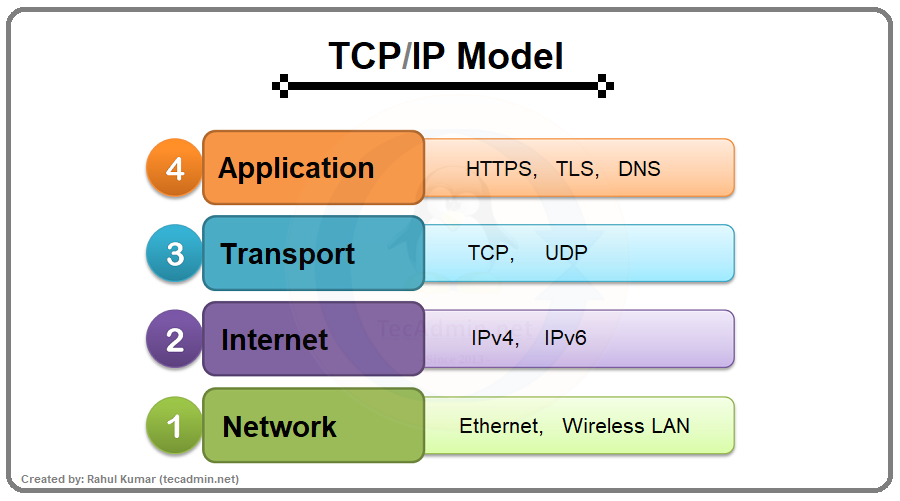
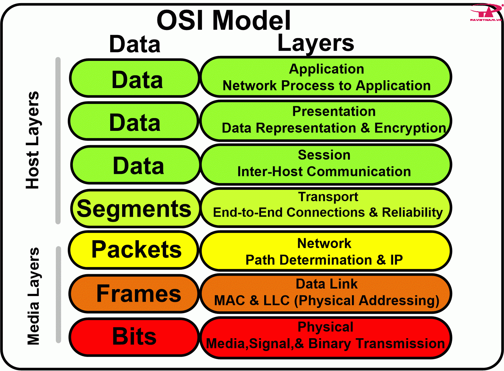

# Protocol

Ở trong bài này chúng ta sẽ tìm hiểu 2 giao thức cơ bản được sử dụng rộng rãi hiện nay là **TCP và UDP**

## 1. TCP (Transmission Control Protocol)

- Là một giao thức mạng quan trọng trong bộ giao thức TCP/IP. TCP hoạt động như một lớp trung gian giữa các ứng dụng và mạng, nó đảm bảo truyền tải giữ liệu tin cậy. Nó nằm ở tầng giao vận (Transport) trong mô hình TCP/IP.

Nói về mô hình TCP/IP thì nó sẽ bao gồm các phần như sau

- Application (Tầng ứng dụng): Cung cấp các dịch vụ cho người dùng như trình duyệt web, gửi email.
- Transport (Tầng giao vận): Đảm bảo truyền tải data tin cậy giữa các ứng dụng.
- Internet (Tầng mạng): gần giống với tầng mạng trong mô hình OSI. Tầng này chịu trách nhiệm định vị và định tuyến dữ liệu giữa các thiết bị.
- Network Access (Tầng vật lý): Chịu trách nhiệm truyền các gói tin từ tầng mạng đến các host trong mạng.



Trong một bài khác chúng ta sẽ nói chi tiết mô hình này và mô hình OSI.

#### Đặc điểm

- Hướng kết nối: TCP thiết lập kết nối giữa 2 máy trước khi truyền dữ liệu.
- Kiểm tra lỗi: TCP sẽ sử dụng `checksum` để kiếm tra lỗi hoặc bị mất giữ liệu trong quá trình vận chuyển, nếu có thì nó sẽ yêu cầu gửi lại dữ liệu đó.
- Kiểm soát luồng: TCP điều chỉnh tốc độ truyền tải tránh tắc nghẽn mạng.
- Đa luồng (multiplexing): TCP cho phép truyền tải nhiều luồng dữ liệu đồng thời điểm trong một kết nối. Khi nhiều ứng dụng cùng một máy chủ hoặc địa chỉ IP, multiplexing giúp chúng gửi và nhận data qua các cổng (port) khác nhau.

#### Hoạt động của TCP

1. Bắt tay 3 bước (three way - handshake)

- Máy chủ A gửi SYN (Synchronize) đến máy chủ B
- B gửi SYN-ACK (Synchronize Acknowledge) đến A
- A gửi ACK (Acknowledge) đến B

2. Truyền tải dữ liệu

- A và B chia nhỏ dữ liệu thành các gói tin
- Mỗi gói tin có chưa thông tin về nguồn, đích, số thứ tự dữ liệu
- Các gói tin được truyền tải qua mạng theo cách riêng biệt

3. Kết thúc kết nối

- Một trong 2 máy chủ gửi FIN (Finish) đến máy chủ kia
- Máy chủ nhận được FIN gửi ACK đến máy chủ gửi FIN

```
SYN, ACK, FIN là các cờ trong TCP, được biểu diễn bằng giá trị 0 và 1.
```

#### Ưu điểm

- Độ tin cậy cao
- Kiểm soát luồng
- Đa luồng

#### Nhược điểm

- Tốn nhiều tài nguyên
- Độ trễ cao: Do quá trình kết nối và kiểm tra lỗi
- Khó khăn trong việc gỡ lỗi

#### Ứng dụng

- Web
- Email
- File Transfer Protocol (FTP): Truyền tải tệp giữa các máy tính
- Telnet: Truy cập từ xa vào máy tính khác => `Chỉ sử dụng trong mạng nội bộ an toàn`
- Secure Shell (SSH): Truy cập bảo mật vào máy tính khác => `Thường được sử dụng truy cập vào các máy chủ Linux, Unix`

## 2. UDP (User Datagram Protocol)

- Là một giao thức mạng được sử dụng để truyền tải dữ liệu giữa các máy tính trên mạng, nó hoạt động ở tầng giao vận (transfer) trong mô hình OSI

Về mô hình OSI (Mô hình 7 lớp)

- Lớp ứng dụng (Application): Cung cấp các dịch vụ ứng dụng dạng như email, web, FTP
- Lớp trình bày (Presentation): Chịu trách nhiệm mã hoá (encode) và giải mã (decode) dữ liệu để các ứng dụng có thê hiểu được
- Lớp phiên (Session): Chịu trách nhiệm quản lý các phiên giao tiếp giữa các ứng dụng
- Lớp vận chuyển (Transfer): Đảm bảo việc truyền tải dữ liệu giữa các máy tính
- Lớp Liên kết dữ liệu (Data Link): Chịu trách nhiệm kiểm soát lỗi và quản lý truy cập kênh truyền
- Lớp vật lý (Physical): Chịu trách nhiệm truyền tín hiệu điện hoặc quang giữa các thiết bị mạng



#### Đặc điểm

- Không hướng kết nối: UDP không thiết lập kết nối trức khi truyền dữ liệu như TCP
- Không kiểm tra lỗi
- Không kiểm soát luồng: UDP không kiểm soát tốc độ truyền tải dữ liệu
- Đơn giản: Có cấu trúc đơn giản hơn TCP

#### Hoạt động của UDP

1. Gói tin UDP được tao ra với thông tin nguồn, đích, cổng và dữ liệu
2. Gói tin UDP được gửi đến mạng
3. Gói tin UDP được truyền đến máy đích
4. Máy đích nhận và xử lý gói tin UDP

#### Ưu điểm

- Nhanh: UDP nhanh hơn TCP vì nó không thiết lập kết nối và kiểm tra lỗi
- Nhẹ: Sử dụng ít tài nguyên CPU hơn
- Đơn giản dễ sử dụng hơn TCP

#### Nhược điểm

- Không tin cậy: Do nó không đảm bảo dữ liệu được truyền tải đầy đủ và đúng thứ tự, lấy ví dụ khi livestream khi mạng bị lag chúng ta sẽ thấy hình ảnh và âm thanh bị mất mà chúng ta không thể nghe lại.

#### Ứng dụng

- Streaming mdeia: Phát trực tiếp
- VoIP: Gọi điện thoại qua mạng internet
- DNS: Chuyển đổi tên miền thành IP
- DHCP: Cấp phát địa chỉ IP tự động cho các thiết bị
